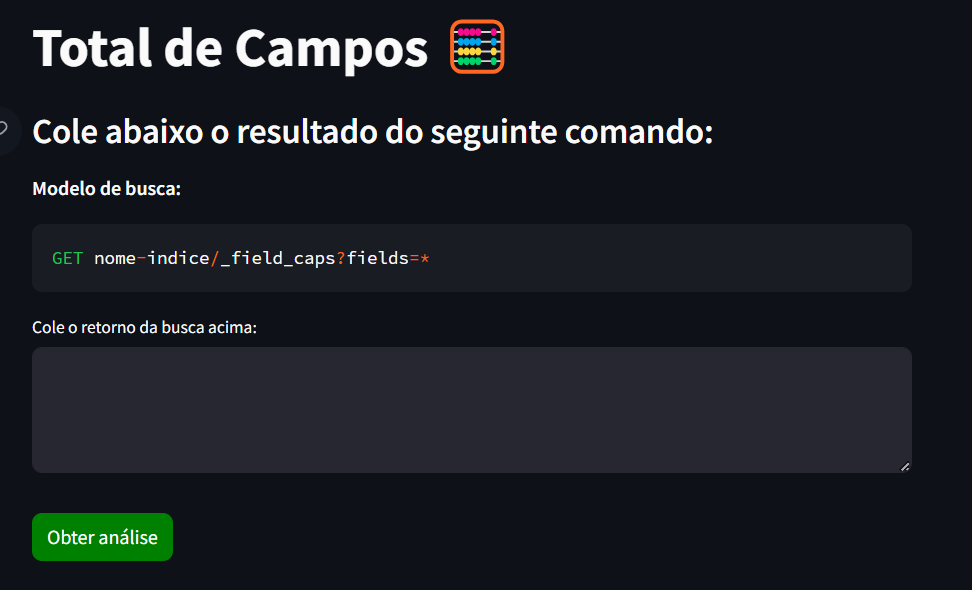
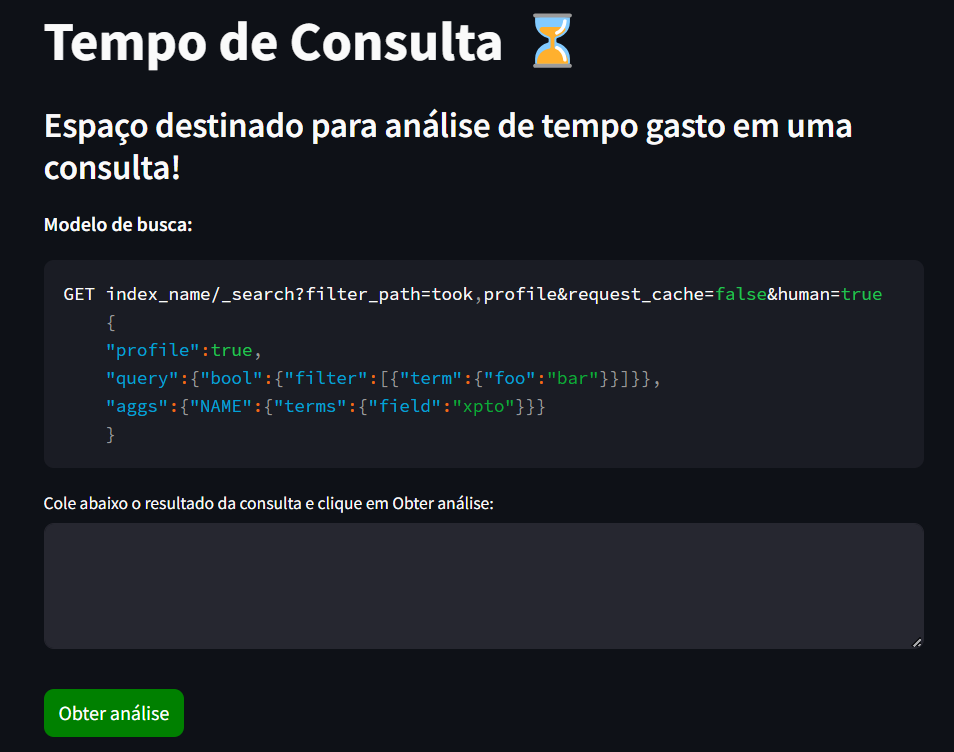
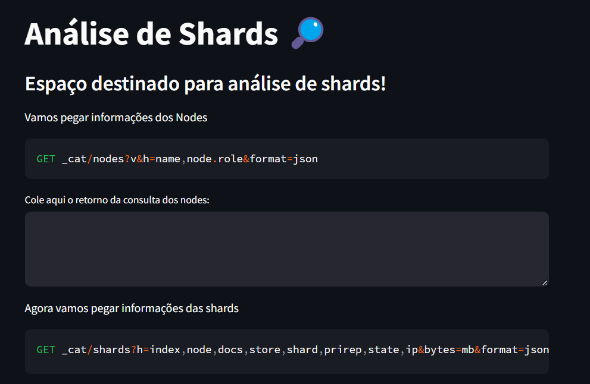

# Elastic Tool

### Recursos em Destaque:

**Total de Campos:** Tenha um controle completo sobre seus índices e documentos, acompanhando o número de campos em tempo real. Uma visão abrangente para melhorar sua estratégia de indexação.

**Tempo de Consulta:** Otimize suas consultas com análises detalhadas de desempenho. Saiba exatamente quanto tempo cada consulta leva e identifique oportunidades de melhoria.

**Análise de Shards:** Compreenda a distribuição dos seus shards e otimize a escalabilidade do seu cluster. Garanta que seus dados estejam distribuídos de forma eficiente.

Simplifiquei algumas análises do Elasticsearch para que você possa focar no que realmente importa: alcançar resultados incríveis com seus dados.

Experimente agora e eleve sua experiência com Elastic para um novo patamar!